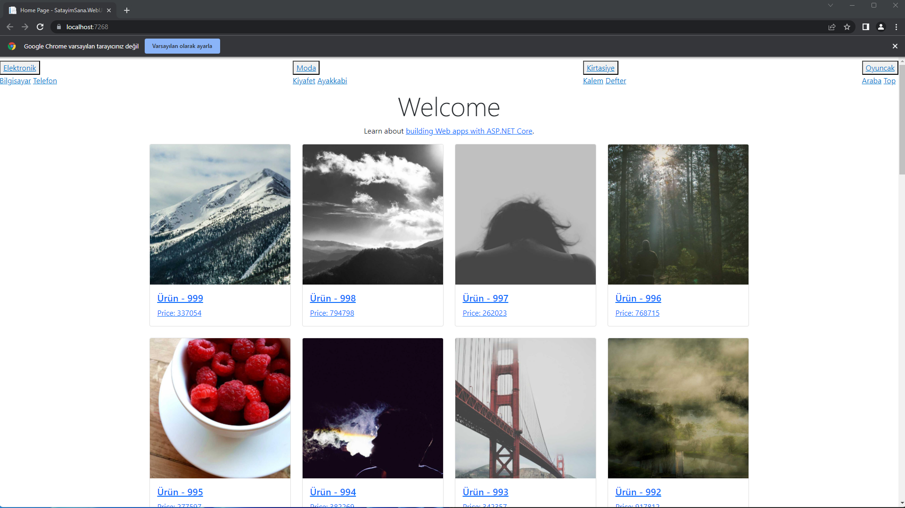
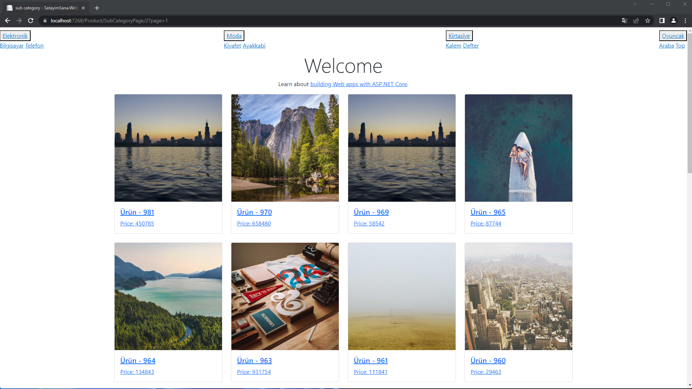
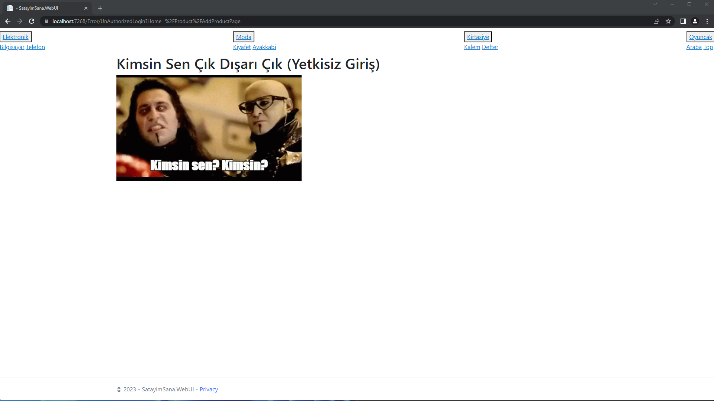
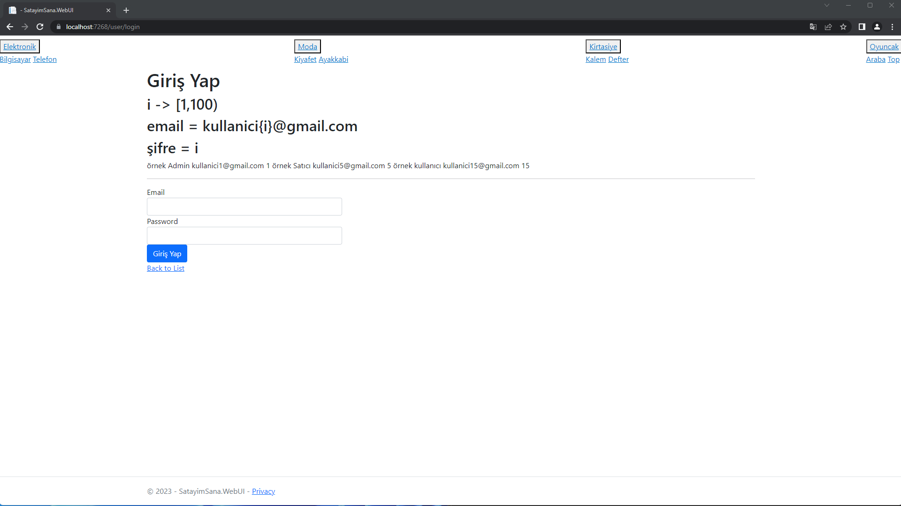
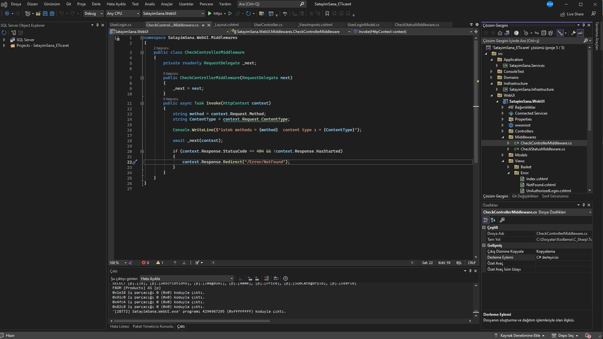
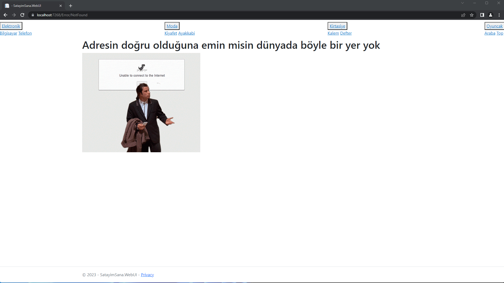

Mvc tarafında kafam basmadığı için oraya çok vakit harcadım bazı oturmayan şeyler var bundan dolayıda hem başka şey öğrenemedim hemde güzel kod yazamadım. 100 üzerinden 20 lik ödev oldu
bu halde artık teslim etmem lazım ki son ödeve konu yetiştireyim bu sebep ile boş kalmasın diye atmaktayım bunu. aslında arayüzü saymazsak 
**middleware** kullanıldı 
**üyelik** uygulandı(üyelik uygulandıda nasıl çalıştığına dair fikrim yok kafam almıyor nedense)

Önemli not: Dil bilgim zayıftır çok takmamaya çalışın
database için -> [DB](Github/DB.sql)
Ekler
1-) [Hangfire nedir (mantıken koda vaktim yoktu)](Github/MDs/HangFire.md)
2-) diğerleri için önce mvc yi halletmem lazım. bunları yapamıyorum yoksa anksiyetem tutuyor bir şeyi tam bilmeden geçince

mvc ile vakit kaybettiğim için ef core tarafıda istediğim gibi olmadı yine kurallara uygun fakat içime sinmedi.
aslında çok kötü ödev değil fakat ben yaptığım şeyde arkaplanını bilmezsem yapamıyorum. mvc içinde sürem yetmedi 1 ay açığım vardı. Durumuma göre
normal bir ödev aslında lakin mvc yi oturtmam lazım. normalde de arap atı gibiyim.

Anasayfa görünümü sayfalı yapı geliyor (hocam sayfalamayı direk sizden çaldım helal edin :D)

bilgisayar kategorisi

yetkisiz giriş yakalama

kullanıcı girişi

middleware ile isteklerde 404 olursa kullanıcılara direk kod değilde anlaşılır sayfa göstersin dedim.

