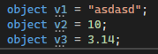
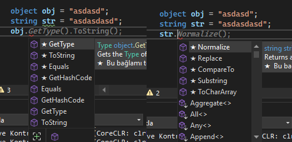
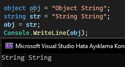
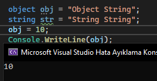
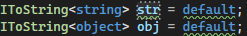
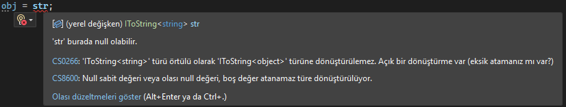

# C#'da Varyans (Kovaryans ve Kontravaryans) Nedir?

#### Bu yazı Turkcell eğitiminin ödevinin bir parçasıdır. Buradaki bilgilerin kesin doğru olması söz konusu değildir. Araştırma sonucu ortaya çıkan bir yazıdır.

### Neden Lazım?

Temelden başlarsak, **C#** içindeki veri tipleri **object** adı verilen sınıftan türetilmiştir. Bu sayede tercih edilmese de aşağıdaki gibi bir üretimde **Visual Studio** hata vermez.

Bunun sebebi **baba-çocuk** ilişkisidir. Bu şekilde veri üretmek veya kendi tipini baştan belirterek üretmek arasında ise çok önemli bir fark vardır. Bu fark **veri tipinin fonksiyonlarıdır**. 

Resimde gördüğünüz üzere iki değişkende **string** veri tipinde olmasına rağmen **object** kökenli oluşan değişken sadece 4 adet temel fonksiyonlara sahiptir. 

Aynı zamanda bu değişkenler arasında eşitlemede yapılabilir.

Hatta **object** ile üretilen değişkene sonradan kendinden üretilen diğer veri tipleride atanabilir. Python severler bunu beğendi :)

Peki bu gösterdiklerimle konumuzun ne alakası var? Bu yüzden hızlıca **interfacelere** geçelim.

Senaryo olar belirtilen bir tipte dönüştürme yapan bir interfaceimiz olsun. 

Peki ne yapacağız bununla derseniz biraz önce **object** ve **string** ile gösterdiğimiz dönüşümleri göstereyim. 

öncelikle tipleri üretirken bir sorun yaşamadık güzel peki eşitlersek. 

işte burada patlarız. normalde **object** tipi içinde barındırılan sınıfları kendisine eşitleyebiliyorken bunu **generic interface** kavramıyla uyguladığımızda hata almaktayız. Şimdi bu örneğimiz gerçek hayata uygun veya mantıklı bir örnek değil fakat ileride bu sorunla karşılaştığımızda ne yapmalıyız veya nasıl bir çözüm uygulamalıyız. 

### Nasıl Çözerim?

aslında sorunun çözümü çok kısa **generic interface** içindeki **generic tip** başına **out** eklemek.

gördüğünüz gibi hata mesajı kayboldu. Peki ben bunu bu şekilde anlattım ve muhtemelen bilmediğiniz bir şey olduğu içinde kafanız karıştı. Bu **out** ne ne işimize yarıyor gibi sorular oluşacaktır. Dahada ilginci bunun birde **in** kelimesi var. Bunları açıklamaya başlayalım.

### Out Nedir?

**Out** anahtar kelimesi ekleyerek aslında biz buradaki **interfaceimize** diyoruz ki **T** tipindeki değişken sadece geri dönüş tipi olarak kullanılacak. Yani **return** olarak ben hep **T** tipi kullanacağım. Tabi geri dönüş kullancaksam. Normalde **out** kullanmasaydık bu kullanımda serbesttik. yani hem değişkenleri **T** tipinde fonksiyona alabilirdik hemde **T** tipinde döndürebilirdik. Şimdi ise sadece döndüreceğiz dedik. 

### Buraya kadar tamamda bu özellik bizim sorunumuzu nasıl çözdü? 

Siz aslında diyorsunuz ki benim **str** değişkenim sadece **string** döndürecek. ayrıca **obj** değişkenimde sadece **object** döndürecek dediniz. **Out** kullandığımız için değişen kısımlar dönüş tipleri. Sonra biz dedik ki **obj = str** burada C# bakıyor. Her şeyleri aynı sadece biri **object** biri **string** döndürecek. aynı zamanda **objnin** üzerine **stryi** yazmaya çalışıyoruz. E **object** zaten **string** içeriyor yani **obj** aslında **stryi** içeriyor. O zaman ben bu eşitlemeyi yaparım der.

### In Nedir?
**Out'un** tam tersi :) yani sadece fonsiyonlarda alınan değişkenlerde tip olarak kullanılacaksa bunlarada **in** deriz.

### Tamam sorun çözüldü. İyide bu ne işe yarayacak.
Microsoft sitesinde bir sürü örnek mevcut ki aşağıda da listeleyeceğim. Fakat her şeyden ayrı sadece geri dönüş olarak kullandığınız tipte başına out ekleyerek sizden sonra gelenleri ve ileride oluşabilecek sorunları önlersiniz bu yüzden basit görünen ama arkaplanda büyük gelişimlere yol açabilecek bir özellik.
[Kovaryans ve Kontravaryans (C#)](https://learn.microsoft.com/tr-tr/dotnet/csharp/programming-guide/concepts/covariance-contravariance/ "Kovaryans ve Kontravaryans (C#)")
[Değişken Genel Arabirimleri Oluşturma (C#)](https://learn.microsoft.com/tr-tr/dotnet/csharp/programming-guide/concepts/covariance-contravariance/creating-variant-generic-interfaces "Değişken Genel Arabirimleri Oluşturma (C#)")
[Değişken Genel Arabirimleri Oluşturma (C#) (C#)](https://learn.microsoft.com/tr-tr/dotnet/csharp/programming-guide/concepts/covariance-contravariance/creating-variant-generic-interfaces?source=recommendations "Değişken Genel Arabirimleri Oluşturma (C#)")
[Genel türlerde kovaryans ve kontravaryans](https://learn.microsoft.com/tr-tr/dotnet/standard/generics/covariance-and-contravariance?source=recommendations "Genel türlerde kovaryans ve kontravaryans")
[out (genel değiştirici) (C# Başvurusu)](https://learn.microsoft.com/tr-tr/dotnet/csharp/language-reference/keywords/out-generic-modifier?source=recommendations "out (genel değiştirici) (C# Başvurusu)")
[in (Genel Değiştirici) (C# Başvurusu)](https://learn.microsoft.com/tr-tr/dotnet/csharp/language-reference/keywords/in-generic-modifier?source=recommendations "in (Genel Değiştirici) (C# Başvurusu)")

